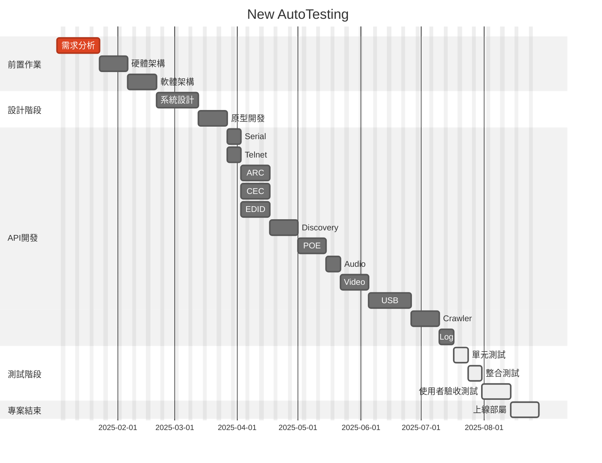

```mermaid
---
config:
  theme: neutral
---
gantt
    title New AutoTesting
    dateFormat  YYYY-MM-DD
    excludes    weekends
    section 前置作業
    需求分析          :crit, des1, 2025-01-02  , 15d
    硬體架構          :des2, after des1  , 10d
    軟體架構          :des3, after des2  , 10d
    section 設計階段
    系統設計          :des4, after des3  , 15d
    原型開發          :des5, after des4  , 10d
    section API開發
    Serial           :dev1, after des5  , 5d
    Telnet           :dev2, after des5  , 5d
    ARC              :dev3, after dev2  , 10d
    CEC              :dev3, after dev2  , 10d
    EDID             :dev3, after dev2  , 10d
    Discovery        :dev4, after dev3  , 10d
    POE              :dev5, after dev4  , 10d
    Audio            :dev6, after dev5  , 5d
    Video            :dev7, after dev6  , 10d
    USB              :dev8, after dev7  , 15d
    Crawler          :dev9, after dev8  , 10d
    Log              :dev10, after dev9  , 5d
    section 測試階段
    單元測試          :active,test1, after dev10  , 5d
    整合測試          :active,test2, after test1  , 5d
    使用者驗收測試     :active,test3, after test2  , 10d
    section 專案結束
    上線部屬          :active,final1, after test3  ,10d
```